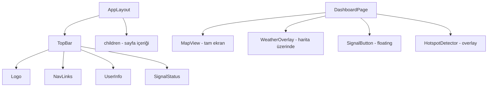

# Tasarım Dokümanı

## Genel Bakış

Sinyaldeyiz uygulamasının UI'ı tamamen yeniden tasarlanacaktır. Mevcut sol dikey sidebar kaldırılıp, üstte ince glassmorphism yatay menü (TopBar) yerleştirilecektir. Dashboard sayfası harita-merkezli olacak: TopBar altındaki tüm alan harita ile kaplanacak, hava durumu widget'ları ve sinyal butonu harita üzerinde overlay olarak konumlanacaktır. Arka plan tutarlı hale getirilecek ve sinyal verme timeout hatası düzeltilecektir.

## Mimari

### Mevcut Yapı (Değiştirilecek)
```
┌──────────────────────────────────┐
│  Sol Sidebar (w-64)  │  İçerik  │
│  - Logo              │  - Header│
│  - Kullanıcı         │  - Hava  │
│  - Nav linkler       │  - Harita│
│  - Çıkış             │  - Stats │
└──────────────────────────────────┘
```

### Yeni Yapı
```
┌──────────────────────────────────┐
│  TopBar (h-14, glassmorphism)    │
│  Logo | Nav | User | Signal      │
├──────────────────────────────────┤
│                                  │
│         HAR İ TA (tam ekran)     │
│                                  │
│  [Hava overlay]    [Sinyal btn]  │
│                                  │
└──────────────────────────────────┘
```

### Bileşen Hiyerarşisi



## Bileşenler ve Arayüzler

### 1. AppLayout (`src/app/(app)/layout.tsx`)

Tamamen yeniden yazılacak. Sol sidebar ve mobil bottom nav kaldırılacak.

```typescript
// Yeni layout yapısı
interface LayoutProps {
  children: React.ReactNode
}

// TopBar + children, sidebar yok
// Arka plan: tek tutarlı gradient veya transparan (harita görünsün diye)
```

**Değişiklikler:**
- Sol sidebar (`<aside>`) tamamen kaldırılacak
- Mobil bottom nav (`<nav>` fixed bottom) kaldırılacak
- Mobil sidebar overlay kaldırılacak
- Yerine `<TopBar />` bileşeni eklenecek
- `main` alanı `ml-64` yerine tam genişlik olacak
- Arka plan gradient'leri sadeleştirilecek (siyah-lacivert geçiş sorunu giderilecek)

### 2. TopBar Bileşeni (`src/components/layout/top-bar.tsx`) — YENİ

```typescript
interface TopBarProps {
  profile: Profile | null
  isGuest: boolean
  pathname: string
  isSignalActive: boolean
  visibleUsersCount: number
  onSignOut: () => void
}
```

**Tasarım:**
- Yükseklik: masaüstü 56px, mobil 48px
- Glassmorphism: `bg-black/30 backdrop-blur-xl border-b border-white/10`
- Solda: Logo (🏎️ Sinyaldeyiz)
- Ortada: Nav linkleri (Ana Sayfa, Harita, Hava, Garaj, Profil) — masaüstünde görünür
- Sağda: Sinyal durumu chip, aktif kullanıcı sayısı, kullanıcı avatarı, çıkış
- Mobilde: Logo sol, hamburger menü sağ (veya kompakt ikonlar)

### 3. DashboardPage (`src/app/(app)/dashboard/page.tsx`)

**Değişiklikler:**
- Racing HUD Header kaldırılacak (greeting, stats)
- Hava durumu widget'ları harita üzerinde overlay olarak taşınacak
- Harita `flex-1` yerine `h-[calc(100vh-56px)]` tam ekran olacak
- Mobil stats bar kaldırılacak
- Sinyal butonu harita üzerinde floating olarak kalacak

### 4. SignalButton (`src/components/dashboard/signal-button.tsx`)

**Değişiklikler:**
- `requestGeolocation` timeout'u 15 saniyeye çıkarılacak (zaten 15000ms, ama hata mesajı iyileştirilecek)
- Timeout hatası durumunda yeniden deneme butonu eklenecek
- Son bilinen konum yedek olarak kullanılabilecek
- Yükleme göstergesi iyileştirilecek

### 5. WeatherOverlay — YENİ konsept

Hava durumu widget'ları artık harita üzerinde glassmorphism overlay olarak gösterilecek. Mevcut `WeatherWidgets` bileşeni korunacak ama konumlandırma değişecek.

## Veri Modelleri

Mevcut veri modelleri değişmeyecek. Değişiklikler tamamen UI/bileşen katmanında.

- `Profile`: nickname, avatar_url, city
- `VisibleUser`: user_id, lat, lon, nickname, vehicle_brand, vehicle_model, expires_at, status_message
- `LocationData`: lat, lon, accuracy_meters


## Doğruluk Özellikleri (Correctness Properties)

*Bir özellik (property), bir sistemin tüm geçerli yürütmelerinde doğru olması gereken bir davranış veya karakteristiktir — esasen, sistemin ne yapması gerektiğine dair biçimsel bir ifadedir. Özellikler, insan tarafından okunabilir spesifikasyonlar ile makine tarafından doğrulanabilir doğruluk garantileri arasında köprü görevi görür.*

Bu özellik büyük ölçüde UI yeniden tasarımı olduğundan, çoğu kabul kriteri görsel/yapısal testlerdir ve property-based testing'e uygun değildir. Ancak sinyal verme hata yönetimi mantığı test edilebilir bir property içerir.

### Property 1: Konum hatası fallback tutarlılığı

*Herhangi bir* konum hatası türü (PERMISSION_DENIED, POSITION_UNAVAILABLE, TIMEOUT) için, `requestGeolocationWithFallback` fonksiyonu çağrıldığında ve son bilinen konum mevcutsa, fonksiyon her zaman ya başarılı bir konum ya da son bilinen konumu döndürecektir (reject etmeyecektir).

**Validates: Requirements 3.3**

## Hata Yönetimi

### Konum Hataları
- **TIMEOUT**: 15 saniye sonra zaman aşımı → kullanıcıya "Konum alınamadı, yeniden deneyin" mesajı + yeniden deneme butonu + son bilinen konum seçeneği
- **PERMISSION_DENIED**: Konum izni reddedildi → kullanıcıya izin verme talimatı
- **POSITION_UNAVAILABLE**: Konum servisi kullanılamıyor → son bilinen konum yedek olarak sunulacak

### UI Hataları
- Harita yüklenemezse → yükleme spinner gösterilecek
- Weather API hatası → "Hava durumu yüklenemedi" mesajı

## Test Stratejisi

### Birim Testleri
- TopBar bileşeninin doğru elemanları render ettiğini doğrulama
- `requestGeolocationWithFallback` fonksiyonunun hata durumlarını doğru yönettiğini doğrulama
- Layout'un sidebar içermediğini doğrulama

### Property-Based Testler
- **Kütüphane**: `fast-check` (mevcut projede zaten kurulu)
- **Minimum iterasyon**: 100
- **Etiketleme formatı**: `**Feature: ui-redesign, Property {number}: {property_text}**`
- Her correctness property tek bir property-based test ile uygulanacak
- Her test, tasarım dokümanındaki ilgili property'yi referans edecek

### Test Kapsamı
- Property 1: Konum hatası fallback tutarlılığı → `requestGeolocationWithFallback` fonksiyonu farklı hata türleri ve son bilinen konum kombinasyonları ile test edilecek
